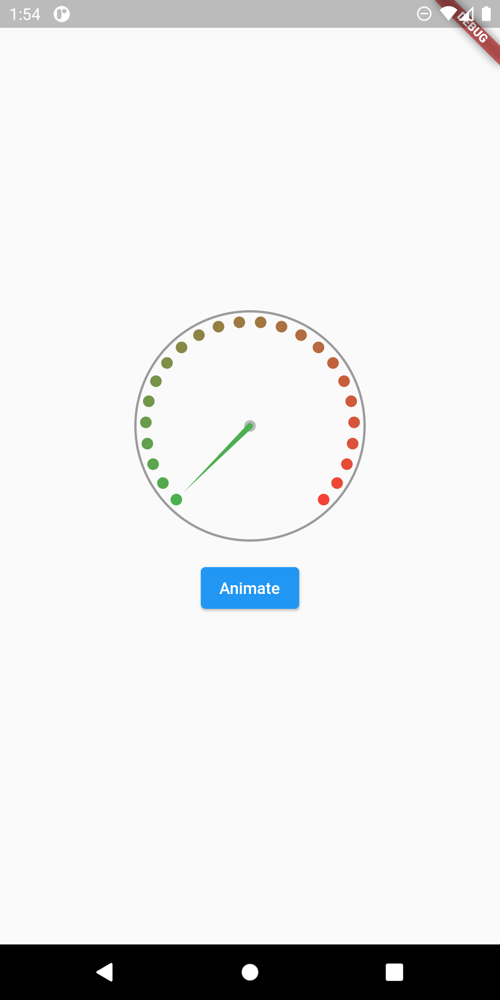
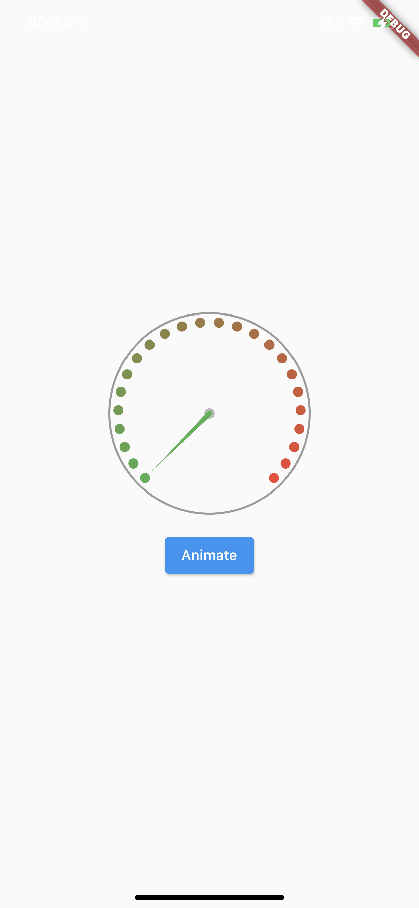
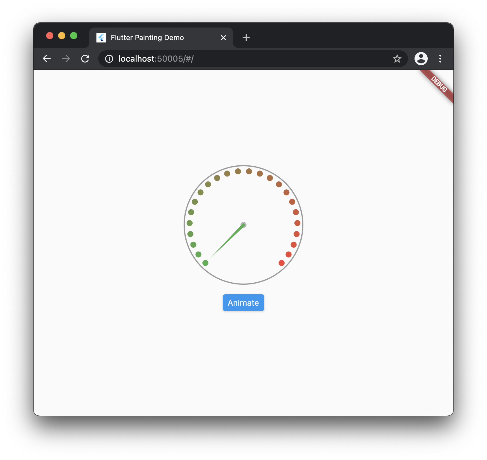
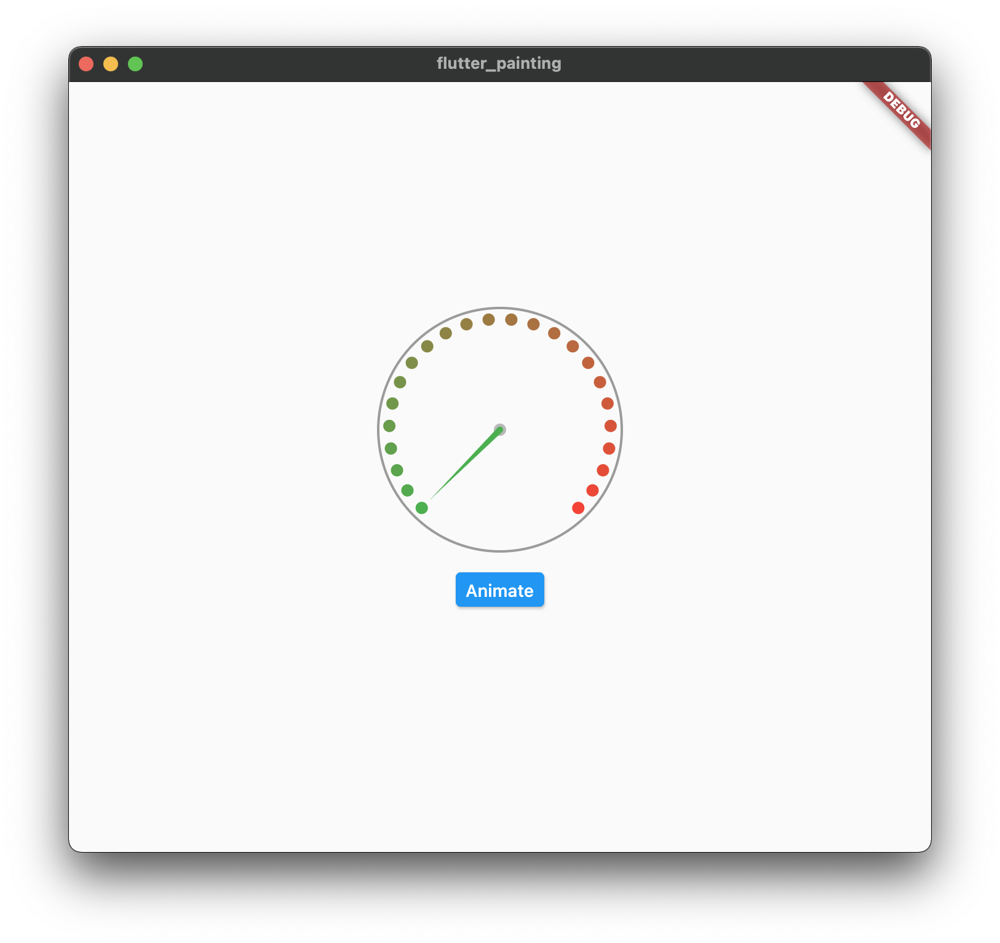

# Flutter CustomPaint & CustomPainter

An example of **CustomPaint** and **CustomPainter** implementation.

[https://medium.com/litslink/flutter-build-your-custom-painter-with-animation-795490acb156](https://medium.com/litslink/flutter-build-your-custom-painter-with-animation-795490acb156)

## Preview

|Rotation Start|Rotation End|
|:-:|:-:|
|||
|||
